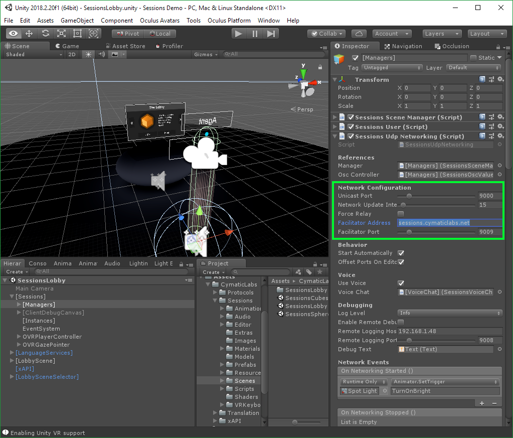

# Sessions
**Unity 3D Client &amp; SDK**

This repository houses the main Unity 3D Sessions project. The Unity 3D project is used to test development of code, and to generate an asset package that can be imported into other Unity projects. Besides the asset package, this project can be duplicated and used as a starting point for creating Sessions-enabled Virtual Reality content.

## What is "Sessions"?

Sessions is a collection of technologies used to build collaborative Virtual Reality tools and experiences with [Unity 3D](https://unity3d.com/). It has a focus on applications for health, therapy, and collaborative learning. The project has no 3rd party service requirements, maintaining 100% control of its own data flow. It emphasizes a peer-to-peer connection model and includes Voice Over IP for user-to-user communication.

Using native and [OSC](http://opensoundcontrol.org) integrations, designers can expose nearly any aspect of the realtime 3D environment to  live manipulation that is network synchronized across all clients, across the Internet. These live sessions and their events can optionally be recorded in multiple ways including into eLearning systems via [xAPI](https://xapi.com) integration. Also provided is the ability to record and "bake" content for later playback, analysis, or distribution.

Each collaborative session has a corresponding Virtual Reality scene and associated content. These scenes can be stored either locally within the application itself or hosted as files and loaded remotely at runtime.

An included Facilitator service/server is provided to allow client NAT punch-through coordination and to act as a packet relay server between peers when NAT negotiation fails.

## Table of Contents

- [Introduction](#introduction)
- [Supported Platforms](#supported-platforms)
- [Installation](#installation)
  - [From Binary](#from-binary)
  - [From Source](#from-source)
    - [Visual Studio](#visual-studio)
  - [From Asset Package](#from-asset-package)
    
## Introduction

The Sessions Unity 3D cient and SDK provide the base project and building blocks required to produce collaborative VR content.

Features:

* Built specifically for network-based, collaborative VR experiences.
* Custom reliable UDP networking system built on top of [LiteNetLib](https://github.com/RevenantX/LiteNetLib).
* Complex scene "wiring" and control system allowing the underlying game engine to be controlled in realtime, in a network synchronized way, including OSC mapping and remote control over WiFi, LAN, and WAN.
* VOIP voice chat solution using [Dissonance](https://assetstore.unity.com/packages/tools/audio/dissonance-voice-chat-70078) and a custom integration.
* Included Facilitator service for session match-making, NAT punch-through, and packet relay
* Event routing system including a basic rules engine to wire network events to the Unity scene and game objects
* Advanced realtime audio mixing system including:
  * sound effects subsystem to aid in efficient efx mixing
  * 10 stereo channels of dedicate audio mixing, including realtime DSP effects sending per channel and OSC control
  * 8 dedicate VOIP channels for mixing user voice chat audio signals
  * 3D positional audio of user voice (optional)
  * audio mixing is exposed to network control system
* Basic lobby and UI system provided for browsing, hosting, and joining sessions.
* Custom interaction system that can be configured to emit [xAPI statements](https://xapi.com/) for integration into eLearning systems.
* Unity components, prefabs, and scripts that can be used to build multi-user, network synchronized content.
* A streamlined custom Unity Editor interface for authoring Sessions content.
* Requires no 3rd party services for either game or voice data.
* Session data recording and playback from memory and file.

## Supported Platforms

Here is a list of current and future planned platform support:

| Platform | Operating System | Supported | Type | Notes |
|----------|------------------|-----------|------------|-------|
| **Oculus Go** | **Android** | **Yes** | **VR** | **initial support** |
| **Windows Desktop** | **Windows** | **Yes** | **Native** | **initial support** |
| Oculus Rift | Desktop | Planned | VR | also uses Oculus SDK |
| Oculus Quest | Android | Planned | VR | also uses Oculus SDK |
| HTC Vive | Desktop | Maybe | VR | more effort to support |
| Magic Leap | Android | Maybe | AR | |
| Mac Desktop | Mac | Maybe | Native | if there is demand |
| Linux Desktop | Linux | Maybe | Native | if there is demand |

## Installation

### From Binary

Binary releases can be found in the releases section, this includes the Unity asset package that can be used to install Sessions into a new or existing Unity project.

### From Source

#### Visual Studio

Pull this repository and build manually. You can open the project in Visual Studio or similar IDE and build. You will need to be able to build both .NET Framework 3.5 (for the Unity version) and .NET Standard 2.0 libraries so make sure the respective .NET resources are installed.

**Note:** Make sure to properly initialize submodules within the repository using `git submodule update --init --recursive`

##### Update Binaries

This next step is optional and is typically only require for development. There are binary .NET class library files that the Unity project references in it's `/Assets/Plugins` folder. Typically these will be kept in sync and updated as part of the project and you will not need to worry about them. However included in these are the Sessions code components that are shared between projects.

If you want to edit, update, or recompile these binaries:
 
 1. Make sure you properly initialized git submobuldes recursively to initialize the **Sessions.Core** repository that is referenced by this repository with `git submodule update --init --recursive`
 2. Open the `/Sessions.Core/Sessions.Core.sln` solution and build.
 3. Depending on the build configuration, locate the build output in either `/Sessions.Core/src/Sessions.Core/bin/Debug` or `/Sessions.Core/src/Sessions.Core/bin/Release` respectively and copy `Sessions.Core.dll` and `Sessions.Core.pdb` and paste them into `/src/Sessions/Assets/Plugins/CymaticLabs` - you can safely copy the entire directory from the build output, or just the Sessions core library.

### From Asset Package

Once you have either created or downloaded the Sessions Unity asset package create or open the project in Unity you would like to install Sessions into. It is generally recommended to start with a fresh project install.

**Note:** Sessions requires .NET Framework 4.x. Once you have your project ready, go to `Edit → Project Settings → Player → Other Settings` and set both **Scripting Runtime Version** and **Api Compatability Level** to **.NET 4.x**.

#### Import Custom Package

Next go to the application menu `Assets → Import Package → Custom Package` and select the Sessions .unitypackage file:

Confirm the asset import:

#### Update Project Settings

Once the package has successfully imported you will be prompted with two windows. Dissonance is used for VOIP and the window can safely be closed and ignored as Sessions has a custom Dissonance integration. The other window is part of the Sessions installation and is recommended that you run or [at least consider the settings](https://developer.oculus.com/blog/tech-note-unity-settings-for-mobile-vr/).

To update the Unity project settings to the recommended settings needed by Sessions press the **Update Project Settings** button.

#### Update Android Compression

Set Anrdoid Texture Compression to: **ASTC**. This setting cannot be adjusted by the project settings update process so it must be changed as a manual step:

#### Set API Compatibility to .NET Framework 4.x

Sessions requires .NET Framework 4.x. Once you have your project ready, go to `Edit → Project Settings → Player → Other Settings` and set both **Scripting Runtime Version** and **Api Compatability Level** to **.NET 4.x**. This also must be done manually and requires a restart of Unity.

#### Adjust Network Settings

Finally when using the Sessions assets in Unity scenes, make sure to configured the **SessionsUdpNetworking** Monobehaviour that can be found on the `[Sessions]` component's managers.

Usually this would only entail changing the IP or hostname for the Facilitator service.

